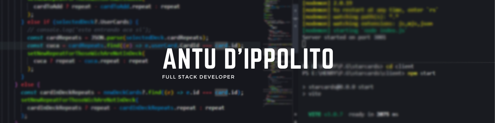

### Hi there 👋, I'm Antu D'Ippolito, a web full stack developer... i need job.

  <li ><a href="mailto:antudippolito123@gmail.com">Mail me 📩</a></li>
</ul>
 
<ul >Some skills...
<h3 align="center">Some skills 🚀</h3>
  <li >Lenguages</li>
     
    

  <li >Enviroment tools</li>
     
    

       
      
    <ul>
      <li> Git & GitFlow</li>
      <li> Postman</li>
      <li> Heroku</li>
      <li> Render</li>
      <li> Vercel</li>
    </ul>
    

     
  <li >DDBB</li>
     
    

      
      <ul>
      <li> Postgresql </li>
      <li> MongoDB</li>
    </ul>
    

     
  <li >Back-end</li>
     
    

      
      
      
    <ul>
      <li> Express</li>
      <li> NodeJS</li>
      <li> Sequelize</li>
      <li> Mongoose & Typegoose</li>
      </ul>
    

     
  <li >Front-end</li>
     
      

        
        
        
      <ul>
        <li> React with JavaScript & TypeScript</li>
        <li> Redux with JavaScript & TypeScript</li>
        <li> Bootstrap</li>
        <li> Material UI</li>
        <li> CSS Styled Components</li>
      </ul>
      

     
  <li >Cooming soon</li>
   
    

      
      <ul>
        <li> MySql</li>
      </ul>
    

   
</ul>
